# Sistema de Monitoramento de Missão Espacial

## Autores

- Guilherme Vinciguerra Carvalho | 571951
- Marcos Peterson Martins Pereira | 573857
- Matheus Jorge Santana | 574166

## Descrição do Projeto

Este projeto foi desenvolvido em linguagem C com o objetivo de simular um sistema básico de monitoramento de uma missão espacial. O programa realiza a coleta, armazenamento e análise de informações operacionais da nave, permitindo identificar possíveis situações de risco e auxiliar na tomada de decisões durante a missão.

O sistema monitora três parâmetros principais:

* Temperatura da nave;
* Nível de energia;
* Status da comunicação.

Além disso, mantém um histórico das leituras realizadas e calcula estatísticas básicas para acompanhamento dos dados coletados.

## Objetivos

O projeto foi desenvolvido para aplicar conceitos fundamentais da linguagem C, incluindo:

* Funções;
* Estruturas condicionais;
* Estruturas de repetição;
* Vetores;
* Validação de entradas;
* Modularização do código;
* Processamento e análise de dados.

## Funcionalidades

### Cadastro de Dados

O sistema permite registrar:

* Temperatura da nave (°C);
* Porcentagem de energia (0 a 100%);
* Porcentagem de comunicação (0 a 100%).

Os dados inseridos passam por validação para evitar valores inválidos.

### Visualização de Status

Após o cadastro, o usuário pode consultar o status atual dos sistemas monitorados.

#### Temperatura

| Condição           | Status                    |
| ------------------ | ------------------------- |
| Temperatura > 80°C | Risco de superaquecimento |
| Temperatura < 10°C | Risco de congelamento     |
| Entre 10°C e 80°C  | Normal                    |

#### Energia

| Condição      | Status                 |
| ------------- | ---------------------- |
| Energia < 20% | Economia de energia    |
| Energia < 40% | Abaixo do recomendável |
| Energia ≥ 40% | Normal                 |

#### Comunicação

| Condição          | Status               |
| ----------------- | -------------------- |
| Comunicação = 0%  | Falha de comunicação |
| Comunicação < 20% | Comunicação instável |
| Comunicação ≥ 20% | Normal               |

### Análise da Missão

O sistema executa uma análise automática dos dados coletados e atribui uma pontuação de risco para a missão.

#### Critérios de Pontuação

Problemas críticos:

* Superaquecimento;
* Energia crítica;
* Falha de comunicação.

Cada problema crítico adiciona:

+2 pontos de risco

Problemas moderados:

* Baixa temperatura;
* Energia abaixo do recomendável;
* Comunicação instável.

Cada problema moderado adiciona:

+1 ponto de risco

### Classificação da Missão

Após o cálculo da pontuação de risco, a missão recebe uma classificação:

| Pontuação  | Situação             |
| ---------- | -------------------- |
| 0          | Missão Segura        |
| 1 a 2      | Missão em Observação |
| Acima de 2 | Missão Crítica       |

### Histórico de Leituras

O sistema armazena até 10 leituras utilizando vetores.

Cada leitura registra:

* Temperatura;
* Energia;
* Comunicação.

O histórico pode ser consultado a qualquer momento pelo usuário.

### Estatísticas

Ao visualizar o histórico, o sistema também calcula:

* Média da temperatura;
* Média da energia;
* Média da comunicação.

Esses valores permitem acompanhar o comportamento geral da missão ao longo do tempo.

## Estrutura do Sistema

O menu principal possui as seguintes opções:

```text
1 - Inserir Dados
2 - Visualizar Status
3 - Executar Análise
4 - Histórico
5 - Encerrar Sistema
```

## Lógica Utilizada

O programa inicia configurando o terminal para utilizar UTF-8, permitindo a exibição correta de caracteres especiais.

Em seguida, entra em um laço infinito responsável por manter o menu principal sempre disponível ao usuário.

```c
while (1)
{
    iniciar_menu();
}
```

Dessa forma, o sistema permanece em execução até que o usuário escolha a opção de encerramento.

### Cadastro dos Dados

Ao selecionar a opção de cadastro, o sistema solicita ao usuário:

* Temperatura;
* Energia;
* Comunicação.

As entradas de energia e comunicação são validadas para garantir que permaneçam entre 0 e 100%.

Após a validação, os dados são armazenados em vetores de histórico.

### Avaliação dos Sensores

- Cada parâmetro possui uma função específica de avaliação.
- A temperatura é analisada para identificar riscos de superaquecimento ou congelamento.
- A energia é analisada para detectar níveis críticos ou abaixo do recomendado.
- A comunicação é monitorada para identificar falhas totais ou instabilidades.
- Essa divisão em funções independentes torna o código mais organizado, reutilizável e fácil de manter.

### Análise da Missão

A análise geral da missão utiliza os dados mais recentes para calcular uma pontuação de risco.

Cada condição crítica ou de alerta contribui para essa pontuação.

Ao final, o sistema classifica automaticamente o estado da missão como:

* Segura;
* Em observação;
* Crítica.

### Histórico e Estatísticas

Todas as leituras realizadas são armazenadas em vetores.

Quando o usuário solicita a visualização do histórico, o sistema percorre os vetores utilizando estruturas de repetição para exibir os dados registrados.

Além disso, calcula médias dos parâmetros monitorados para fornecer uma visão geral do comportamento da missão.


## Fluxogramas do Sistema

Abaixo estão as imagens dos fluxogramas do sistema:

### Fluxograma Principal

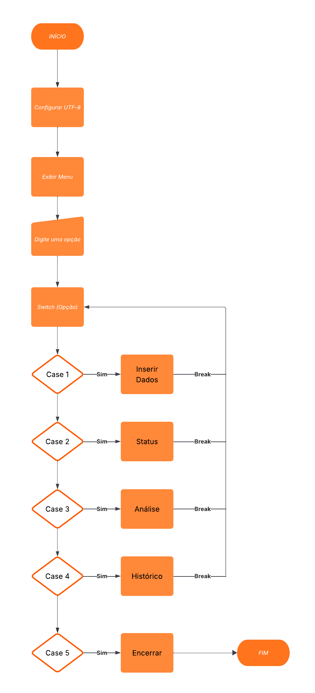

### Fluxograma Inserção de Dados

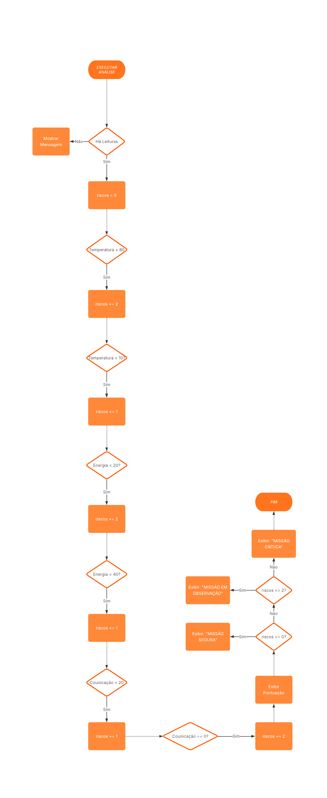

### Fluxograma de Análise da Missão

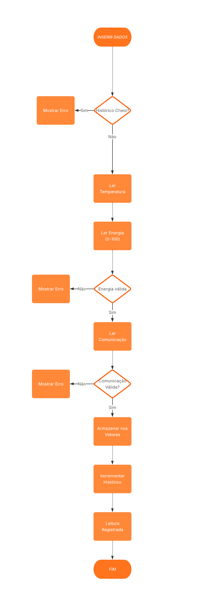

## Demonstração Prática do Sistema

Abaixo estão as imagens da demonstração prática do sistema:

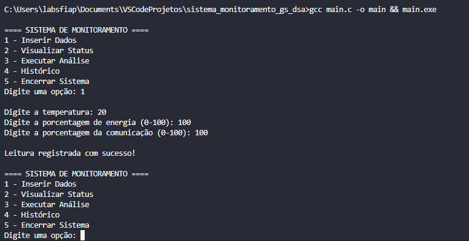

<br>

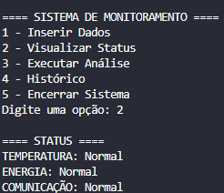

<br>

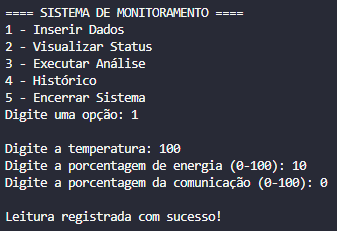

<br>

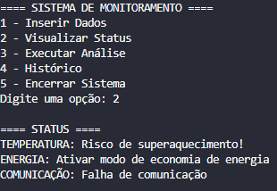

<br>

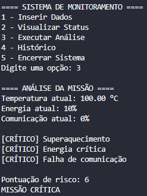

<br>

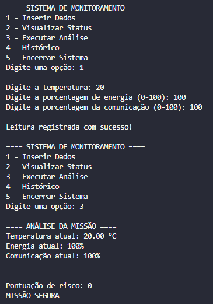

<br>

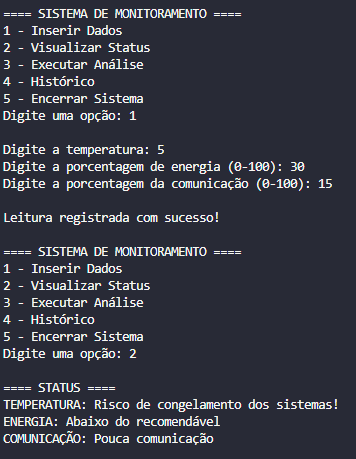

<br>

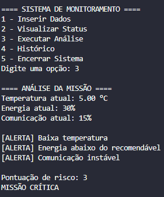

<br>

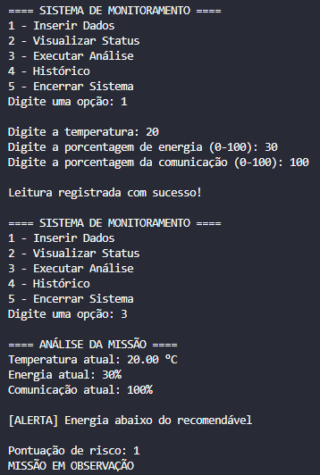

<br>

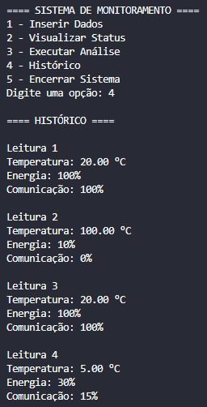

<br>

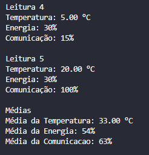

<br>

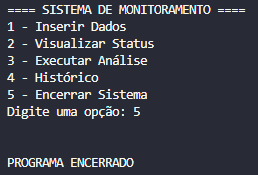

## Tecnologias Utilizadas

* Linguagem C
* Biblioteca ```stdio.h```
* Biblioteca ```stdlib.h```
* Biblioteca ```windows.h```

## Compilação

### GCC (MinGW)

```bash
gcc main.c -o monitoramento
```

### Execução

```bash
monitoramento.exe
```
